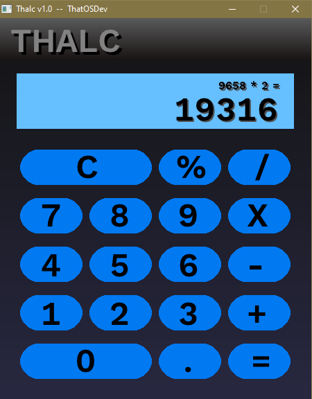

# thalc  
That Calculator -- I needed one that didn't use up my internet bandwith with it's spyware.  
  
  
This has been tested to work on windows only so far.  But since I'm using Raylib 4.5 library, change the PLATFORM_DESKTOP to what you need for other operating systems. Read the raylib docs to know more, or simply ask the raylib group on their discord.  
  
  
For windows users, as long as your gcc.exe (mingw) is in your path, you should be able to just simply run the bat file.  
  
  
    